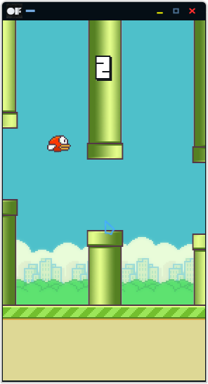

# ofFlappyBird
A port of [FlapPyBird](https://github.com/sourabhv/FlapPyBird) using OpenFrameworks. Either use the latest release(linux) or build 
from source. Currently only tested on linux. 

# Installation
- Download [OpenFrameworks](https://openframeworks.cc/download/) for your platform and install the dependencies.
- Clone the repo.
```bash
$ git clone https://github.com/TheLogicMaster/ofFlappyBird
```
Or just download as zip and extract.
- Change the Makefile so that the OpenFrameworks path points to your installation.
- Build and run the project like any OpenFrameworks project using Make. 
```bash
$ make
$ make RunRelease
```

# Todo
- Port to android, if I get around to removing the random absolute coordinates and look 
into image scaling/viewports
- Actually fix the logic for the collision testing code, as it produces pixel Y coordinate one 
too high for images and would cause out of bounds exceptions, so there's just an additional
check now.
- Get it working with 

# ScreenShot

